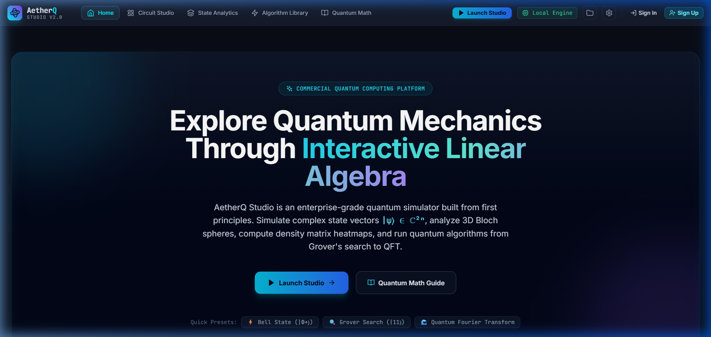
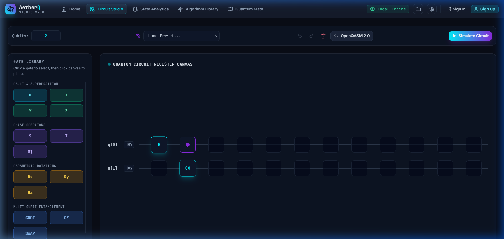
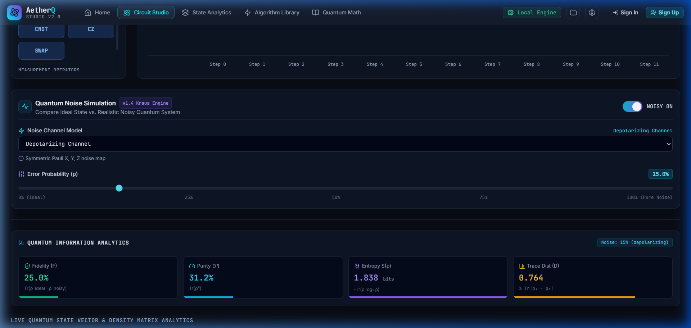
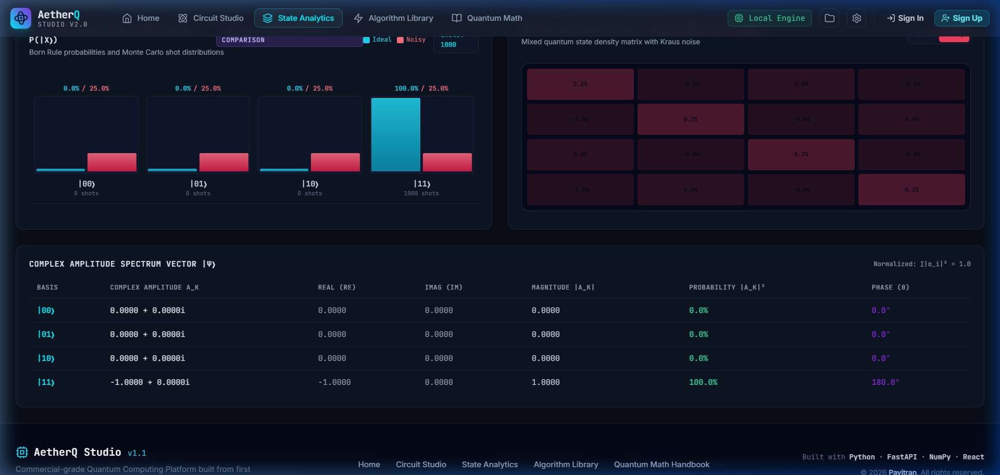
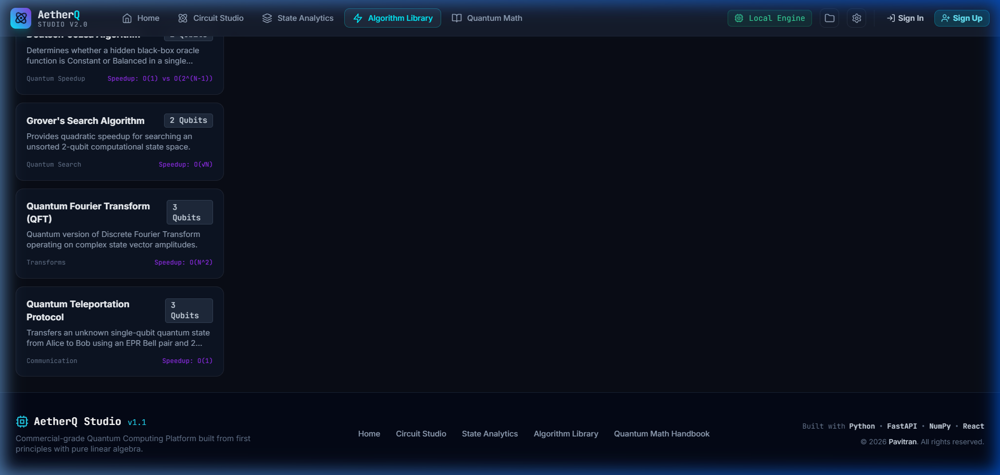

# AnuvaQ — Interactive Quantum Computing & Noise Simulation Platform

[](https://anuvaq.vercel.app/)
[](https://anuvaq-backend.onrender.com/health)
[](https://github.com/Pavitran2006/AnuvaQ)
[](https://github.com/Pavitran2006/AnuvaQ)

> **AnuvaQ** is a full-stack interactive quantum computing and noise simulation platform built from first principles. It features a custom linear algebra Quantum State Vector Simulator & Density Matrix Kraus Noise Engine written in pure Python/NumPy (zero external quantum framework dependencies), a FastAPI REST backend with PostgreSQL persistence and JWT security, and a scientific React 18 circuit studio.

---

### 🌐 Live Production Links
* **Frontend Web App**: [https://anuvaq.vercel.app/](https://anuvaq.vercel.app/)
* **FastAPI Backend Service**: [https://anuvaq-backend.onrender.com](https://anuvaq-backend.onrender.com)
* **API Documentation**: [https://anuvaq-backend.onrender.com/docs](https://anuvaq-backend.onrender.com/docs)
* **GitHub Repository**: [https://github.com/Pavitran2006/AnuvaQ](https://github.com/Pavitran2006/AnuvaQ)

---

## 📸 Platform Screenshots


*Landing Page — Modern Scientific Hero Section with Quick Algorithm Presets*


*Circuit Studio — Categorized Gate Palette, Drag-and-Drop Matrix Canvas & Noise Control Panel*


*Quantum Noise Simulation Engine — Kraus Operator Depolarizing Channel & Quantum Information Metrics ($F, \mathcal{P}, S, D$)*


*Live Visual Analytics — 3D Bloch Spheres, Dual-Bar Histogram, Density Matrix Heatmap & Amplitude Spectrum*


*Algorithm Library — Pre-configured Grover Search, Deutsch-Jozsa, QFT & Teleportation Algorithms*

---

## 🏗️ System Architecture

```text
               +----------------------------------+
               |        React 18 + Vite           |
               |      (Vercel SPA Hosting)        |
               +----------------------------------+
                                |
                   HTTPS / JWT Authorization
                                |
                                v
               +----------------------------------+
               |         FastAPI Backend          |
               |      (Render Docker Service)     |
               +----------------------------------+
                      /                    \
                     v                      v
      +-------------------------+  +-------------------------+
      |  NumPy Quantum Engine   |  |   PostgreSQL Database   |
      | (State Vectors & Noise) |  |   (Cloud User Circuits) |
      +-------------------------+  +-------------------------+
```

---

## 🌟 Key Capabilities

### ⚛️ Pure NumPy Quantum Simulator
- **State Vector Mechanics**: Simulates $N$-qubit state vectors $|\psi\rangle \in \mathbb{C}^{2^N}$, matrix tensor products $U_1 \otimes U_2$, Born rule collapse, partial trace reduced density matrices, and Von Neumann entanglement entropy.
- **Supported Quantum Gates**: $H, X, Y, Z, S, T, RX, RY, RZ, U3, CX (CNOT), CZ, SWAP, CCX (Toffoli)$.
- **Pre-configured Algorithms**: Bell State Generator, Deutsch-Jozsa, Grover's Search Algorithm, Quantum Fourier Transform (QFT), and Quantum Teleportation Protocol.

### 🧪 Density Matrix Kraus Noise Engine
- **Density Matrix Evolution**: Full $2^N \times 2^N$ density matrix dynamics ($\rho \in \mathbb{C}^{2^N \times 2^N}$).
- **Kraus Noise Channels**: Bit Flip, Phase Flip, Depolarizing Channel, Amplitude Damping (spontaneous emission), and Phase Damping (pure dephasing).
- **Quantum Information Metrics**:
  - **Fidelity ($F$)**: State overlap between ideal pure state $|\psi\rangle$ and noisy mixed state $\rho_{\text{noisy}}$.
  - **Purity ($\mathcal{P}$)**: $\text{Tr}(\rho^2)$ metric indicating decoherence.
  - **Von Neumann Entropy ($S$)**: $S(\rho) = -\text{Tr}(\rho \log_2 \rho)$.
  - **Trace Distance ($D$)**: Distinguishability measure between states.

### 🔐 Authentication & Cloud Workspace
- **JWT Security**: Secure password hashing with Bcrypt and signed JSON Web Tokens.
- **PostgreSQL Persistence**: User workspace creation, circuit saving, retrieving, duplicating, and deleting.
- **OpenQASM 2.0 Interoperability**: Bidirectional OpenQASM code parsing and code export.

---

## 🧪 Verification & Testing

- **Backend Unit & E2E Test Suite**: 24 / 24 PASSED (`python -m pytest app/tests -v` in 2.38s).
- **Frontend Static Compilation**: 0 ERRORS (`npx tsc --noEmit`).
- **Production Build**: Clean bundle compilation (`npm run build` in 6.14s).

---

## ☁️ Production Deployment Architecture

* **Frontend**: Hosted on **Vercel** (`Root Directory: frontend`, Framework: `Vite`).
* **Backend**: Hosted on **Render** as a Linux Docker Container (`uvicorn app.main:app`).
* **Database**: Managed **PostgreSQL** provisioned on Render.

---

## 🛠️ Tech Stack

* **Backend**: Python 3.11, FastAPI, NumPy, SQLAlchemy 2.0, PostgreSQL, Pytest, PyJWT, Passlib (Bcrypt), Docker.
* **Frontend**: React 18, Vite, TypeScript, TailwindCSS, Zustand, Lucide Icons, Axios.

---

## 🚀 Local Development Setup

```bash
# 1. Clone repository
git clone https://github.com/Pavitran2006/AnuvaQ.git
cd AnuvaQ

# 2. Setup Backend
cd backend
python -m venv venv
venv\Scripts\activate
pip install -r requirements.txt
python -m uvicorn app.main:app --host 0.0.0.0 --port 8000

# 3. Setup Frontend (in a new terminal)
cd frontend
npm install
npm run dev
```

- **Frontend App**: `http://localhost:5173`
- **Backend API Docs**: `http://localhost:8000/docs`
