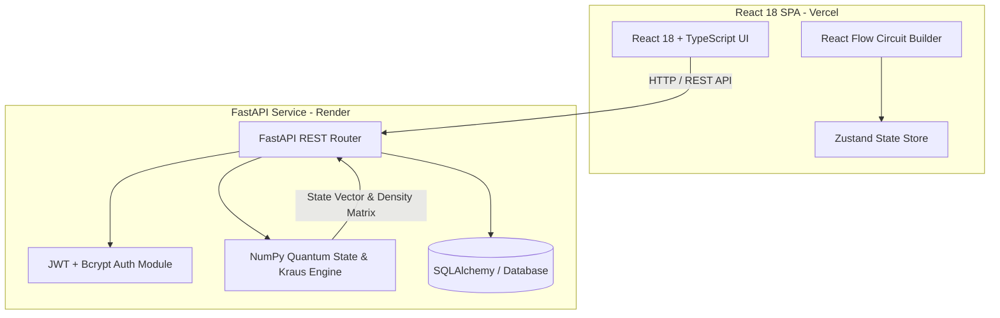

# ⚛️ AnuvaQ — Interactive Quantum Computing & Noise Simulation Platform

A high-performance full-stack quantum computing and quantum noise simulation platform built from first principles. It features a custom linear algebra quantum state vector & density matrix noise simulator written in Python and NumPy, a FastAPI REST API backend with SQLite/PostgreSQL persistence and JWT security, and an interactive React 18 circuit studio.

🔗 **Live Frontend:** [anuvaq.vercel.app](https://anuvaq.vercel.app/)  
🔗 **Backend API Docs:** [anuvaq-backend.onrender.com/docs](https://anuvaq-backend.onrender.com/docs)  
🔗 **GitHub Repository:** [github.com/Pavitran2006/AnuvaQ](https://github.com/Pavitran2006/AnuvaQ)  

---

## 📸 Screenshots


*Landing Page — Interactive Hero Section with Quick Algorithm Presets*


*Circuit Studio — Visual Gate Palette, Circuit Canvas & Noise Control Panel*


*Quantum Noise Simulation Engine — Kraus Operator Depolarizing Channel & Information Metrics*


*Live Analytics — Dual-Bar Histogram, Density Matrix Heatmap & Amplitude Spectrum*

---

## ✨ Features

- ⚛️ **Pure NumPy Quantum Simulator:** Calculates $N$-qubit state vectors ($|\psi\rangle \in \mathbb{C}^{2^N}$), matrix tensor products ($U_1 \otimes U_2$), Born rule collapse, partial trace reduced density matrices, and Von Neumann entanglement entropy without external quantum framework dependencies.
- 🌫️ **Kraus Noise Channel Simulation:** Simulates realistic quantum decoherence using Kraus operator matrices (Bit Flip, Phase Flip, Depolarizing Channel, Amplitude Damping, and Phase Damping).
- 📊 **Quantum Information Metrics:** Calculates State Fidelity ($F$), Density Matrix Purity ($\mathcal{P} = \text{Tr}(\rho^2)$), Von Neumann Entropy ($S$), and Trace Distance ($D$).
- 🎛️ **Visual Circuit Builder:** Interactive circuit studio built with React Flow, custom gate palette, and real-time state calculation updates.
- 📜 **Algorithm Presets:** Built-in circuit presets for Bell State Generator, Deutsch-Jozsa, Grover's Search Algorithm, Quantum Fourier Transform (QFT), and Quantum Teleportation.
- 🔐 **Authentication & Workspace Persistence:** JWT user authentication with password hashing (Bcrypt) and persistent workspace storage via SQLAlchemy.

---

## 🏗️ Architecture



---

## 🛠️ Tech Stack

- **Frontend:** React 18, TypeScript, Vite, Tailwind CSS, React Flow, Zustand, Axios, Lucide React
- **Backend:** Python 3.11, FastAPI, Uvicorn, NumPy, SciPy, Pydantic, SQLAlchemy, PyJWT, Passlib (Bcrypt)
- **Testing:** Pytest, HTTPX
- **Container & Deployment:** Docker, Docker Compose, Vercel (Frontend), Render (Backend API)

---

## 📂 Project Structure

```text
AnuvaQ/
├── backend/
│   ├── app/
│   │   ├── api/           # FastAPI REST routes (auth, circuits, simulation)
│   │   ├── core/          # JWT configuration and security handlers
│   │   ├── db/            # SQLAlchemy database models and session setup
│   │   ├── quantum/       # Pure NumPy quantum state vector & Kraus noise engine
│   │   └── tests/         # Pytest backend test suite
│   ├── Dockerfile
│   └── requirements.txt
├── frontend/
│   ├── src/
│   │   ├── components/    # Circuit builder, analytics graphs, and gate palette
│   │   ├── store/         # Zustand global application state
│   │   ├── types/         # TypeScript quantum circuit definitions
│   │   └── App.tsx
│   ├── package.json
│   └── vite.config.ts
├── screenshots/           # Platform UI screenshots
└── docker-compose.yml
```

---

## ⚙️ How It Works

1. **Circuit Assembly:** Users drag and drop quantum gates onto the circuit grid in the React Flow interface.
2. **State Payload:** The circuit state array is serialized into JSON and sent to the FastAPI `/api/simulate` endpoint via Axios.
3. **Quantum Engine Calculation:** The Python backend computes unitaries via tensor products ($\bigotimes U_i$) using NumPy, calculates the overall state vector $|\psi\rangle$, applies selected Kraus operators for noise channels, and constructs the density matrix $\rho$.
4. **Analytics Response:** The API returns state probabilities, fidelity metrics, and density matrix elements to the frontend for visualization via dynamic histograms and heatmaps.

---

## 🚀 Getting Started

### Prerequisites
- Python 3.10+
- Node.js 18+

### 1. Backend Setup
```bash
cd backend
python -m venv venv

# On Windows:
venv\Scripts\activate
# On Linux/macOS:
source venv/bin/activate

pip install -r requirements.txt
python -m uvicorn app.main:app --reload --port 8000
```
Backend API will run at `http://localhost:8000`. Interactive API Docs are available at `http://localhost:8000/docs`.

### 2. Frontend Setup
```bash
cd frontend
npm install
npm run dev
```
Frontend development server will run at `http://localhost:5173`.

---

## 🧪 Testing

Automated Pytest suite covers backend API endpoints, state vector calculations, and noise matrix fidelity calculations:

```bash
cd backend
python -m pytest app/tests -v
```

TypeScript compilation check for frontend:
```bash
cd frontend
npx tsc --noEmit
```

---

## 🌐 Deployment

- **Frontend:** Deployed on **Vercel** (`https://anuvaq.vercel.app/`)
- **Backend API:** Deployed on **Render** as a Dockerized Linux service (`https://anuvaq-backend.onrender.com`)

---

## 🔮 Future Improvements

- [ ] Add OpenQASM 3.0 export and import compatibility.
- [ ] Implement VQA (Variational Quantum Eigensolver) simulation modules.
- [ ] Add WebAssembly (Wasm) state vector calculations directly in the browser.

---

## 👨‍💻 Author

**Pavitran Anand**  
- GitHub: [github.com/Pavitran2006](https://github.com/Pavitran2006)  
- LinkedIn: [linkedin.com/in/pavitrananand](https://linkedin.com/in/pavitrananand)  
